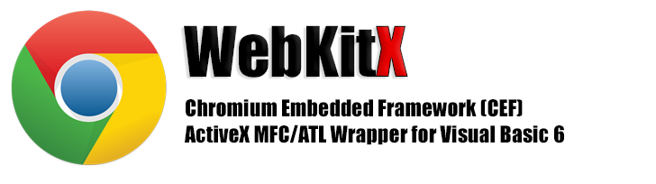
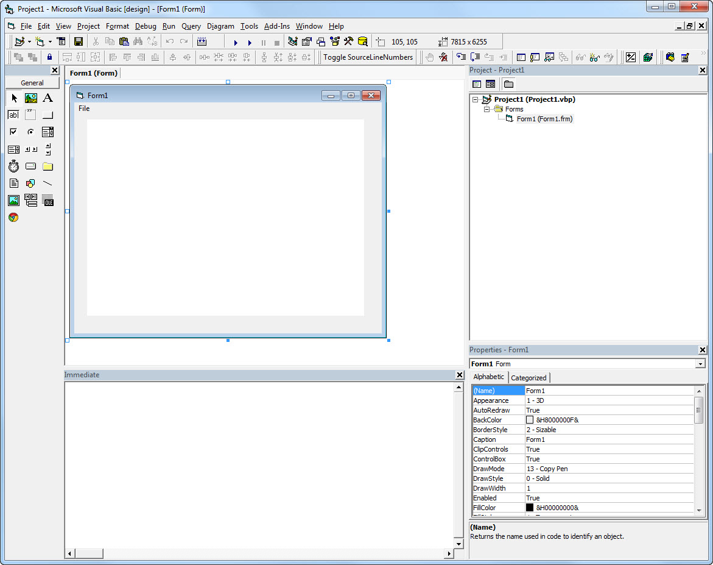

[](https://www.paypal.com/cgi-bin/webscr?cmd=_s-xclick&hosted_button_id=MGVFWZBWKFTPN)

WebKitX
=======

This is a Visual Studio 2010 SP1 C++ MFC/ATL ActiveX Project that wraps Chromium Embedded Framework (CEF) version 1.1364.1123 for use with OLE/COM languages such as Visual Basic 6.0 SP1.

Background
----------

Purpose of this project was to create a light-weight CEF ActiveX wrapper for CEF3 but due to several problems with multithreading and VB6, I decided to wrap CEF1 first and then move to CEF3 slowly.

CEF is the acronym for **Chromium Embedded Framework**, which encapsulates **WebKit HTML5 Renderer** and **Google V8 JavaScript VM** engine. Currently there are two versions available, CEF1 (obsolete) and CEF3. 

The main architectural difference between CEF1 and CEF3 is that CEF3 is using using sub-processes (.exe files) mainly for rendering, and synchronizes all processes using IPC. This adds some process-management complexity wrapping it into an ActiveX and for that reason I decided to deal with CEF1 first.

CEF has two static libraries: **libcef.lib** and **libcef_dll_wrapper.lib**. Both static libraries must be compiled with **/MD** before you can successfully link them with an ActiveX DLL project. I have added some comments about it at the end of this doc.

The idea of wrapping CEF into an ActiveX is very simple:

* You create a MFC/ATL ActiveX Control class that will create the **CefBrowser** object. MFC ActiveX controls inherit from **COleControl** which in turn inherits from **CWnd** and therefore have a **hWnd** window handle. We wait until the first paint of the control and create the CefBrowser passing to it the hWnd handle of the control.

**The class must inherit from COleControl and CefApp IN THAT ORDER - IT IS IMPORTANT!!**

```C++
class CWebKitXCtrl : public COleControl, public CefApp
{
}
```

* We also create WebKitHandler, a simple **CefClient** descendant class that will be receiving callbacks from CefBrowser using callback definition classes such as **CefLifeSpanHandler**. There is a vast array of callback classes you can multiple-inherit WebKitHandler from, depending on the extend of control you need.

```C++
class WebKitHandler : public CefClient, public CefLifeSpanHandler
{
}
```

The trick for successfully wrapping CEF into an ActiveX is two use two classes, one for the actual ActiveX Control and one for the Browser handler. The reason is that CEF classes implement some short of their own **reference counting mechanism** and if you combine them it creates a reference counting mess.

The challenge wrapping CEF into ActiveX
---------------------------------------
CEF1 implementation was very straight forward, but there was a problem related with **CefShutdown()** that if called on ActiveX Control Destructor it would permanently unload CEF Runtime without being able to re-initialize on the same process. 

As a result of this problem, the ActiveX would work perfectly only once and next time you would try to run it from the same process (eg. reload the Form that uses it) it wouldn't load CEF Runtime.

This behavior is related with CEF assuming that runs inside an .EXE and not inside an OLE Host. **CefShutdown()** must be called in order to terminate several background threads, that if not terminated crash the ActiveX when it unloads.

The DllCanUnloadNow() Hack
--------------------------

The hack I decided to do was to prevent the ActiveX .OCX file from unloading until the host process actually dies. To do so I return S_FALSE on **DllCanUnloadNow()**.

```C++
	STDAPI DllCanUnloadNow(void)
	{
		AFX_MANAGE_STATE(AfxGetStaticModuleState());

		if (_AtlModule.GetLockCount() > 0)
			return S_FALSE;

		if(HOST_PROCESS_STILL_RUNNING)
			return S_FALSE;

		CefShutdown();

		return S_OK;
	}
```

Also, I initialize CEF only once using a static class variable:

```C++

bool CWebKitXCtrl::InitCEF()
{
	if(!CWebKitXCtrl::CEF_INITIALIZED)
	{
		CefSettings settings;
		settings.multi_threaded_message_loop			= true;
		settings.graphics_implementation				= ANGLE_IN_PROCESS; // H/W Accelerated Canvas & WebGL
		settings.pack_loading_disabled					= true;
		settings.auto_detect_proxy_settings_enabled		= true;
		settings.uncaught_exception_stack_size			= 10;			

		CefRefPtr<CefApp> app;
		CWebKitXCtrl::CEF_INITIALIZED = CefInitialize(settings, app);		
	}
	return CWebKitXCtrl::CEF_INITIALIZED;
};
```

ActiveX Interface
------------------
I have implemented a small robust API on the ActiveX as an example. The API functions open a URL, put/get HTML and enable/disable HTML5 editing. The API demonstrates all CEF-related bizzares and how to do things properly; Some CEF functions are **asynchronous** and must run of certain CEF threads before the ActiveX can get the results on its main thread, and pass it to VB6. It should be very easy to extend my code and add your own functions.

ActiveX Events
--------------

An important note about ActiveX Events (COM Connection Points) is that they must be fired from the main thread and not from CEF thread. I am using Timers for firing events and it seems to be working ok. Note that ActiveX Events must not be re-entrant or unexpected failures and crashes might happen. Ideally you should use a static variable to sync re-entrancy.

```C++
void FireOnReady() { SetTimer(eventidOnReady, 10, OnReadyTimerProc); }
static void CALLBACK OnReadyTimerProc(HWND hwnd, UINT uMsg, UINT_PTR idEvent, DWORD dwTime) { g_instnace->OnReadyTimer(); }
void OnReadyTimer() { KillTimer(eventidOnReady); OnReady(); }

void FireOnCreate() { SetTimer(eventidOnCreate, 10, OnCreateTimerProc); }	
static void CALLBACK OnCreateTimerProc(HWND hwnd, UINT uMsg, UINT_PTR idEvent, DWORD dwTime) { g_instnace->OnCreateTimer(); }	
void OnCreateTimer() { KillTimer(eventidOnCreate); OnCreate(); }
```

HTML5 DOM Events (addEventListener)
-----------------------------------

An interesting implementation is attaching DOM events and using VB6 class functions or global module functions for callbacks.

```VB6
Private Sub WebKitX1_OnReady()
    WebKitX1.addEventListener "btn1", "click", AddressOf Module1.OnClick
    WebKitX1.addEventListenerEx "btn1", "click", Me, "OnClick"
End Sub
```

The following code demonstrates the proper way to attach a DOM event. You need to execute the attachment code using **CefPostTask** in the CEF UI Thread, and you need two helper classes to do so: a **CefDOMVisitor** for asynchronous access to the DOM and **CefDOMEventListener** for handling the event and performing the callback.

Remember, VB6 functions are __stdcall and VB6 objects are COM objects. In the first case we need to cast `AddressOf <handler>` to `typedef LONG (__stdcall *VISUAL_BASIC_6_FN_PTR)();` and in the second case we need to use 	`IDispatch` interface.

```C++
////////////////////////////////////////////////////////////////////////////////////////////////////////////////////////////////////////////////
// Add Event Listener to Visual Basic 6 Class Public Function
void CWebKitXCtrl::addEventListenerEx(LPCTSTR Selector, LPCTSTR Event, IDispatch* vbObject, LPCTSTR vbObjectFunctionName)
{
	USES_CONVERSION;
	AFX_MANAGE_STATE(AfxGetStaticModuleState());
	CefPostTask(TID_UI,	NewCefRunnableFunction(&ExecuteAddEventEx, std::string(T2A(Selector)), std::string(T2A(Event)), vbObject, std::string(T2A(vbObjectFunctionName))));
}

////////////////////////////////////////////////////////////////////////////////////////////////////////////////////////////////////////////////
void CWebKitXCtrl::ExecuteAddEventEx(std::string elementID, std::string eventType, IDispatch* vbObject, std::string vbObjectFunctionName)
{		
	REQUIRE_UI_THREAD();	

	struct T
	{
		IDispatch* vbObject;
		std::string vbObjectFunctionName;
	};

	T handler;
	handler.vbObject = vbObject;
	handler.vbObjectFunctionName = vbObjectFunctionName;	

	debugPrint("addEventListenerEx(%s, %s, %d, %s)\n", elementID.c_str(), eventType.c_str(), (LONG)handler.vbObject, handler.vbObjectFunctionName.c_str());

	//------------------------------------------------------------------------------------
	class Listener : public CefDOMEventListener 
	{
	public:		
		T handler;
		Listener(T handler)
		{
			this->handler = handler;			
		}
		virtual void HandleEvent(CefRefPtr<CefDOMEvent> event) 
		{
			USES_CONVERSION;
			CefRefPtr<CefDOMNode> element = event->GetTarget();
			DISPID disp;
			LPOLESTR fnName = A2OLE(this->handler.vbObjectFunctionName.c_str());
			debugPrint("%s\n", fnName);
			HRESULT hr = this->handler.vbObject->GetIDsOfNames(IID_NULL, &fnName, 1, LOCALE_SYSTEM_DEFAULT, &disp);
			if(SUCCEEDED(hr))
			{
				DISPPARAMS dispparamsNoArgs;			
				dispparamsNoArgs.cArgs=0;
				dispparamsNoArgs.cNamedArgs=0;
				this->handler.vbObject->Invoke(disp, IID_NULL, LOCALE_SYSTEM_DEFAULT, DISPATCH_METHOD, &dispparamsNoArgs, NULL, NULL, NULL);
			}
		}
		IMPLEMENT_REFCOUNTING(Listener);	
	};

	//------------------------------------------------------------------------------------
	class Visitor : public CefDOMVisitor 
	{
	public:
		T handler;
		std::string elementID;
		std::string eventType;
		Visitor(std::string elementID, std::string eventType, T handler) 
		{
			this->handler = handler;
			this->elementID = elementID;
			this->eventType = eventType;
		}
		virtual void Visit(CefRefPtr<CefDOMDocument> document) 	OVERRIDE
		{
			CefRefPtr<CefDOMEventListener> listener(new Listener(this->handler));
			CefRefPtr<CefDOMNode> element = document->GetElementById(this->elementID);
			if(element || element.get())
				element->AddEventListener(this->eventType, listener, false);
		}
		IMPLEMENT_REFCOUNTING(Visitor);
	};

	g_instnace->m_Browser->GetFocusedFrame()->VisitDOM(new Visitor(elementID, eventType, handler));
}
```

Using a template you can define custome event callback signatures like this:

```C++

typedef LONG (__stdcall *VISUAL_BASIC_6_FN_PTR)(<event parameters here>);

///////////////////////////////////////////////////////////////////////////////////////////////////////////////////////////////////////////////
// Add Event Listener to Visual Basic 6 Global Function Callback
void CWebKitXCtrl::addEventListener(LPCTSTR Selector, LPCTSTR Event, LONG AddressOfEventHandler)
{
	USES_CONVERSION;
	AFX_MANAGE_STATE(AfxGetStaticModuleState());		
	CefPostTask(TID_UI,	NewCefRunnableFunction(&ExecuteAddEvent, std::string(T2A(Selector)), std::string(T2A(Event)), AddressOfEventHandler));	
}

////////////////////////////////////////////////////////////////////////////////////////////////////////////////////////////////////////////////
void CWebKitXCtrl::ExecuteAddEvent(std::string elementID, std::string eventType, LONG AddressOfEventHandler)
{	
	VISUAL_BASIC_6_FN_PTR vbFunc = (VISUAL_BASIC_6_FN_PTR)AddressOfEventHandler;	
	g_instnace->__addEventHandler<VISUAL_BASIC_6_FN_PTR>(elementID, eventType, vbFunc); 
}

////////////////////////////////////////////////////////////////////////////////////////////////////////////////////////////////////////////////
template<typename T> void CWebKitXCtrl::__addEventHandler(std::string elementID, std::string eventType, T handler)
{
}
```

Visual Basic 6 Sample
---------------------



The Visual Basic sample project simply demonstrates how to use WebKitX API.

```VB6
Option Explicit

Private Const S_HTML = "<html><body><button id='btn1'>Hello CEF</button></body></html>"

Private Sub Form_Resize()
    On Error Resume Next
    WebKitX1.Move 0, 0, ScaleWidth, ScaleHeight
    Err.Clear
End Sub

Private Sub mnuEditable_Click()
    mnuEditable.Checked = Not mnuEditable.Checked
    If mnuEditable.Checked Then
        WebKitX1.Edit
    Else
        WebKitX1.Preview
    End If
End Sub

Private Sub mnuGet_Click()
    Debug.Print WebKitX1.HTML
End Sub

Private Sub mnuOpen_Click()
    WebKitX1.OpenURL "http://www.mobilefx.com"
End Sub

Private Sub mnuPut_Click()
    WebKitX1.HTML = S_HTML
End Sub

Private Sub WebKitX1_OnCreate()
    WebKitX1.HTML = S_HTML
End Sub

Private Sub WebKitX1_OnReady()
    WebKitX1.addEventListener "btn1", "click", AddressOf Module1.OnClick
    WebKitX1.addEventListenerEx "btn1", "click", Me, "OnClick"
End Sub

Public Function OnClick() As Long
    MsgBox "Clicked - handled by class"
End Function
```

Future Work
-----------
I plan to integrate CEF3 but my goal is to create an **HTML5 WYSIWYG Editor** for my Coconut2D Studio IDE project, so I if CEF3 is a pain to integrate I won't bother too much.

DLLs and Libraries
------------------
I have included pre-built CEF1 and CEF3 libraries and their required DLLS that are needed only if you enable Hardware Accelerated Graphics (settings.graphics_implementation = ANGLE_IN_PROCESS). In theory if you choose a software graphics engine then the DLLs are not required.

| Folder                | Description                                                 |
|-----------------------|-------------------------------------------------------------|
| \CEF					|                                                             |
| \CEF\CEF1             | CEF1 Root                                                   |
| \CEF\CEF1\DLLs        | Required Runtime DLLs and Resources                         |
| \CEF\CEF1\include     | Include Files                                               |
| \CEF\CEF1\lib         | Link Libraries                                              |
| \CEF\CEF3             | CEF3 Root                                                   |
| \CEF\CEF3\DLLs        | Required Runtime DLLs and Resources                         |                               
| \CEF\CEF3\include     | Include Files                                               |                                      
| \CEF\CEF3\lib         | Link Libraries                                              |
| \CEF3Process          | CEF3 Process                                                |
| \VB6                  | Visual Basic 6 Sample                                       |


```text

```

Notes about compiling CEF1|3 for ActiveX
----------------------------------------
If you decide to compile CEF yourself you will need to do the following:

1. Disable all C++ **Compiler Warnings** and remove the **Treat Warnings as Errors**.

2. Change in C++ Code Generation the Threading Model from /MT (for .exe) to **/MD** (for .DLL)

Contact me if you need any help.

Author
------
Elias Politakis,
mobileFX CTO/Partner.

Contribute / Donate
-------------------
If this project is useful for you, you can help me sustain it either by contributing or by donating with Paypal.

[](https://www.paypal.com/cgi-bin/webscr?cmd=_s-xclick&hosted_button_id=MGVFWZBWKFTPN)


